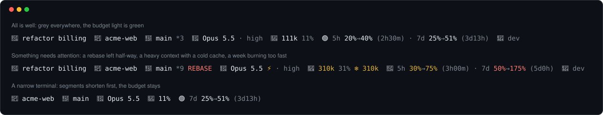

# Status line for Claude Code

[](https://github.com/hybrid2102/statusline-for-claude-code/actions/workflows/ci.yml)
[](https://github.com/hybrid2102/statusline-for-claude-code/releases/latest)
[](LICENSE)


A [status line](https://code.claude.com/docs/en/statusline) for Claude Code that tells you
at a glance whether you can **push harder or should slow down**, and stays quiet the rest of
the time.



## Why this one

Most status lines show everything they can. This one follows two rules:

1. **Every segment must lead to a decision.** Session duration or lines changed are
   interesting, but you would read them and then do nothing about it, so they are not shown.
2. **Colour means "look here".** When all is well the line is grey, apart from the budget
   light. Yellow and red appear only on what needs your attention, so they are noticed
   when they show up.

The segments answer four questions, left to right:

| Question | Segments |
| --- | --- |
| Am I working in the right place? | 🔖 session · 📁 project · 🌿 branch |
| Which levers decide how much I consume? | 🤖 model · effort |
| How heavy is the next message? | 🧠 context · ❄ cold cache |
| Can I push harder, and whose budget is it? | 🟢 5h · 7d budget · 👤 account |

## Reading the line

### The budget light 🟢 🟡 🔴

Subscriptions are limited by two rolling windows, 5 hours and 7 days. For each one the line
shows how much you have used, **where you will land at the reset if you keep this pace**, and
how long until the reset:

```
🟢 5h 20%→40% (2h30m) · 7d 25%→51% (3d13h)
```

The projection is `used ÷ fraction of the window elapsed`: 20% used half-way through the
5-hour window projects to 40%. The light follows the window in the worst shape:

| Light | Projection at reset | Meaning |
| --- | --- | --- |
| 🟢 | below 70% | You have room: push harder |
| 🟡 | 70% to 100% | You are on track: keep going |
| 🔴 | 100% or more | At this pace the budget runs out before the reset: slow down |

The colour goes by the projection, not by how much you have used: 50% of the weekly budget
gone after two days is red (projection 175%), even though "50%" alone would not look
worrying. In the first 10% of a window the projection is too noisy to mean anything, so the
line shows usage only and judges it more cautiously. On a pay-as-you-go account there are
no windows, and the session cost in dollars is shown instead.

### Context 🧠

`🧠 111k 11%` is the size of the context, which is what every message costs, followed by the
share of the window it fills. It turns **yellow past 200k tokens or 70%** and **red past
90%**: the moments to consider `/compact` or `/clear`. With a 1M-token window the percentage
alone would stay low long after messages have become expensive, so the token count comes
first.

`❄ 310k` appears when the prompt cache has gone cold, typically after a break: the next
message will resend those 310k tokens at full price. With a large context, that is a good
moment to `/clear` or `/compact` rather than carry on.

### Git 🌿

`🌿 main *9 ↑2` shows the branch, the number of changed files and the commits to push or
pull, all in grey, because that is the normal state of work. **Red** is reserved for what
blocks you: conflicts (`!2`), an operation left half-way (`REBASE`, `MERGE`, `PICK`,
`REVERT`, `BISECT`) and a deleted upstream. In a worktree its name follows the branch
(`🌳 hotfix`).

### Everything else

- **📁 project**, with the sub-folder if you are working inside one (`acme-web/src/…/api`)
  and `+N` for extra folders added to the session.
- **🤖 model · effort**, plus the output style when it is not the default. **⚡** marks fast
  mode, the only engine setting that costs more and therefore gets a colour.
- **👤 account**: the part of your e-mail before the `@`, plus the profile folder when it is
  not the standard `.claude`. With several profiles open in different windows, this is how
  you tell whose budget you are spending.
- **🆕 v1.3.0 /statusline-update**, at the end of the line, when a newer release is out.
  Run `/statusline-update` in Claude Code to install it (see [Updating](#updating)).

### Narrow terminals

The line adapts to the terminal width. Segments are **shortened before any is dropped** (the
effort goes before the branch does), and the least important go first. The budget is the
last to disappear.

## Install

### Windows

1. Download `statusline-for-claude-code-vX.Y.Z.zip` from the
   [latest release](https://github.com/hybrid2102/statusline-for-claude-code/releases/latest)
   and unzip it anywhere.
2. Double-click **`install.bat`**.
3. Restart Claude Code.

The installer:

- checks that Node.js 18 or later is available, and warns if git is not;
- copies `statusline.mjs` to `%USERPROFILE%\.claude`;
- sets the `statusLine` key in `settings.json`, **changing nothing else** (other settings,
  and options such as `padding`, are kept) after writing a timestamped backup;
- if several Claude Code profiles exist, asks which ones to configure;
- **never silently replaces a newer or hand-edited script** with an older package, so
  carrying an old copy of the zip to another machine does no harm;
- adds the `/statusline-update` command to each profile it configures;
- finishes with a test run on sample data, so you see the line before restarting.

Running it again is safe: it notices that everything is in place and changes nothing.

| Parameter | Effect |
| --- | --- |
| `-ConfigDir <folder>` | Configure this profile only, e.g. `"$HOME\.claude-work"` |
| `-ScriptDir <folder>` | Install the script somewhere other than `~\.claude` |
| `-Force` | Replace an installed script even if it is newer or was edited |
| `-NonInteractive` | Never prompt: configure the default profile and keep a newer script |

Exit code `0` means success, `1` a missing prerequisite or a failed test run, and `2` a
profile whose `settings.json` could not be updated.

### macOS and Linux

The status line itself is plain Node.js and works everywhere Claude Code does; only the
installer is Windows-specific. Install it by hand:

```sh
mkdir -p ~/.claude
curl -fsSLo ~/.claude/statusline.mjs \
  https://github.com/hybrid2102/statusline-for-claude-code/releases/latest/download/statusline.mjs
```

Then add this to `~/.claude/settings.json`:

```json
{
  "statusLine": {
    "type": "command",
    "command": "node ~/.claude/statusline.mjs"
  }
}
```

For the `/statusline-update` command, save this as
`~/.claude/skills/statusline-update/SKILL.md`:

```markdown
---
description: Update the Claude Code status line to its latest release
disable-model-invocation: true
allowed-tools: Bash(node ~/.claude/statusline.mjs --update)
---

!`node ~/.claude/statusline.mjs --update`

Above is the report of the status line's self-update. Tell the user in one or two sentences whether it was updated, and from which version to which. If it lists changes, summarize them in a few bullet points. Run no other command.
```

### Several profiles

If you use separate Claude Code profiles (for example `~/.claude` for personal use and
`~/.claude-work` for work, selected with `CLAUDE_CONFIG_DIR`), the script is installed
**once** and every profile points to it, so an update is a single file.

On Windows, `claude-profile.bat` starts Claude Code on an alternative profile: double-click
it and type the name (`work` for `.claude-work`), or run `claude-profile.bat work`. It lists
the existing profiles and asks for confirmation before a mistyped name creates a new, empty
one.

## Requirements

- **Node.js 18 or later.**
- **git** on the `PATH`, optional: without it only the branch segment disappears.
- **A terminal that renders emoji and ANSI colours**: Windows Terminal, iTerm2, most Linux
  terminals. The legacy Windows console host cannot draw emoji.

## Updating

When a new release is out, the line ends with `🆕 v1.3.0 /statusline-update`. Type
**`/statusline-update`** in Claude Code: the script downloads the release and checks it
against the release's `SHA256SUMS.txt` and its own version line. It then runs the new
version once on sample data, keeps the old one as `statusline.mjs.bak-<version>`, and
swaps it in. Claude tells you what changed. The new version shows from the next refresh,
with no restart.

The same works from any terminal:

```sh
node ~/.claude/statusline.mjs --update
```

The check for new releases runs at most **once a day**, in a background process, so the
line never waits for the network. To turn it off, set `STATUSLINE_NO_UPDATE_CHECK=1`, for
example in the `env` section of `settings.json`; `/statusline-update` keeps working.

Running `install.bat` from a newer release still works as well. Each release is listed in
the [changelog](CHANGELOG.md).

## Troubleshooting

**The line is empty.** Run the script by hand with a minimal input; it should print a line:

```sh
echo '{"model":{"display_name":"test"}}' | node ~/.claude/statusline.mjs
```

**A segment is missing or looks wrong.** Create an empty file named `statusline.debug` in
your profile folder (`~/.claude`). From the next refresh, each input Claude Code sends is
saved to `claude-statusline-input.json` in your temp folder (`%TEMP%` on Windows). Delete
`statusline.debug` when you are done. Attaching that file to an
[issue](https://github.com/hybrid2102/statusline-for-claude-code/issues/new/choose) is
the fastest way to get a fix; remove anything you would rather not publish first.

**The line shows `⚠ statusline: …`.** The script hit an error, but kept showing the folder
and model rather than disappearing. Please report the message.

## Privacy

The status line reads the input Claude Code sends, the `oauthAccount.emailAddress` field
of `.claude.json` and the output of `git status`. Its only network request is the daily
check for a new release, which asks the GitHub API for the latest release of this project
and sends nothing about you or your sessions; it can be turned off. It writes only the
result of that check, next to the script, and a copy of its input if you enable debug
mode. [SECURITY.md](SECURITY.md) has the details.

## Contributing

Issues and pull requests are welcome; [CONTRIBUTING.md](CONTRIBUTING.md) explains the
principles the line follows and how to run the tests.

## License

[MIT](LICENSE)
